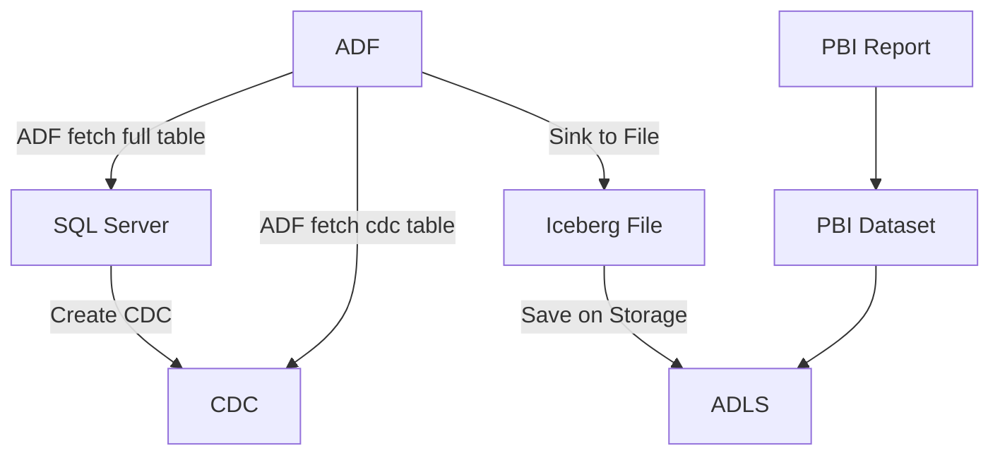

# README

This is an example of a CDC (Capture Data Change) pipeline using several different popular ETL Set-Ups. We are working on creating the following pipeline that can take care of:

- Handling Upserts
- Handling Deletes
- Not require a full load of the existing data
- Allow loading small single tables (full replace) while allowing larger tables to be loaded over time through CDC (incremental)

Therefore, the following architecture is used as proof of concept:



In the case of orchestration, the following is supported:

- [x] [Spark](./cdc-apache-iceberg)
- [ ] [Dagster](./cdc-dagster) (close to be working, but still WIP)

By leveraging Apache Iceberg, an optimized MERGE INTO statement can be utilized that correctly merges records based on the operation type (INSERT, UPDATE, DELETE) and the primary key.

## Demo

[Demo - CDC Spark](cdc-demo-apache-iceberg.mp4)

## Reference

A big thanks to the following projects to make this work in an as efficient way as possible:
- [Apache Iceberg](https://iceberg.apache.org/)
- [Apache Spark](https://spark.apache.org/)
- [Pola.rs](https://pola.rs/)
- [Dagster](https://dagster.io/)

## Extra

Within the ETL community there are several tools, the 3 most famous ones are Delta Lake, Apache Iceberg and Apache Hudi. Comparing them is not as straightforward, but the following table is commonly looked at:

|Feature| Delta Lake | Apache Iceberg | Apache Hudi |
|-------|------------|----------------|-------------|
|Open Source| Yes (although commercial) | Yes | Yes |
| Primary Use Case| ACID transactions, data quality, spark integration | Large Scale Analytics + Schema Evolution | Fast data updates, streaming, and ETL |

As Databricks is part of Databricks enterprise, it makes more sense to go int othe Apache Iceberg ecosystem for classical BI. This might however change as Databricks decided to acquire [Tabular](https://www.tabular.io/blog/tabular-is-joining-databricks/) which was the storage engine company behind Apache Iceberg (which was in its turn initially created by Netflix). So the future will become interesting. 

More material:
- https://youtu.be/QNmSXMQ-gY4?t=2022
- https://medium.com/@kywe665/delta-hudi-iceberg-a-benchmark-compilation-a5630c69cffc
- https://estuary.dev/blog/apache-iceberg-vs-apache-hudi/#choosing-between-apache-iceberg-and-apache-hudi
- https://www.linkedin.com/pulse/iceberg-vs-hudi-delta-lake-choosing-right-open-table-format-kargin-xaa5e/
- https://medium.com/@masterkeshav/data-engineering-iceberg-on-azure-synapse-spark-pool-bbea85ccb106
- https://learn.microsoft.com/en-us/azure/data-factory/format-iceberg
- https://www.datacamp.com/tutorial/apache-iceberg
- https://www.tabular.io/blog/docker-spark-and-iceberg-the-fastest-way-to-try-iceberg/

## Troubleshooting

### Invalid peer certificate: UnknownIssuer

This is because the SSL Certificate File is not being found. Set it manually through the below:

```bash
# This file is created automatically through `sudo update-ca-certificates`
# if you are missing your CA, add it in `/usr/local/share/ca-certificates/`
export SSL_CERT_FILE=/etc/ssl/certs/ca-certificates.crt
```

### Can't open lib 'ODBC Driver 18 for SQL Server' : file not found (0) (SQLDriverConnect)

Install the driver as per [Documentation (Linux)](https://learn.microsoft.com/en-us/sql/connect/odbc/linux-mac/installing-the-microsoft-odbc-driver-for-sql-server?view=sql-server-ver15&tabs=alpine18-install%2Calpine17-install%2Cdebian8-install%2Credhat7-13-install%2Crhel7-offline#18) or [Documentation (macOS)](https://learn.microsoft.com/en-us/sql/connect/odbc/linux-mac/install-microsoft-odbc-driver-sql-server-macos?view=sql-server-ver15)

### ImportError: libodbc.so.2: cannot open shared object file: No such file or directory

Install the linux odbc driver `sudo apt install unixodbc`