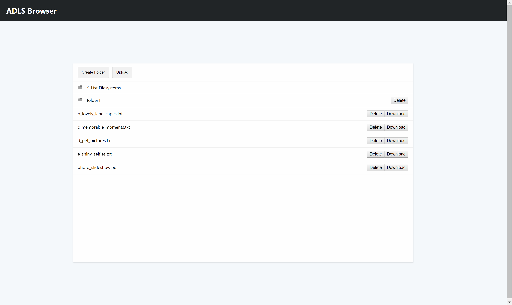
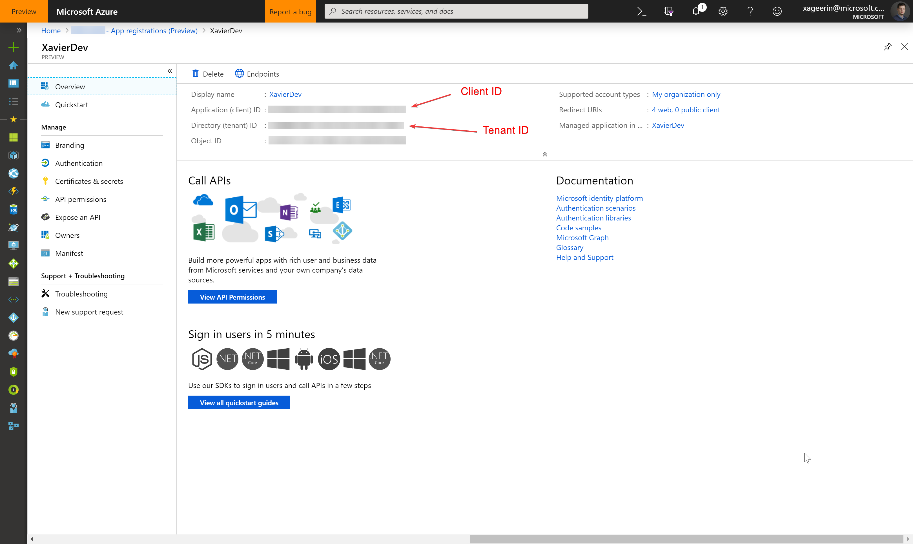
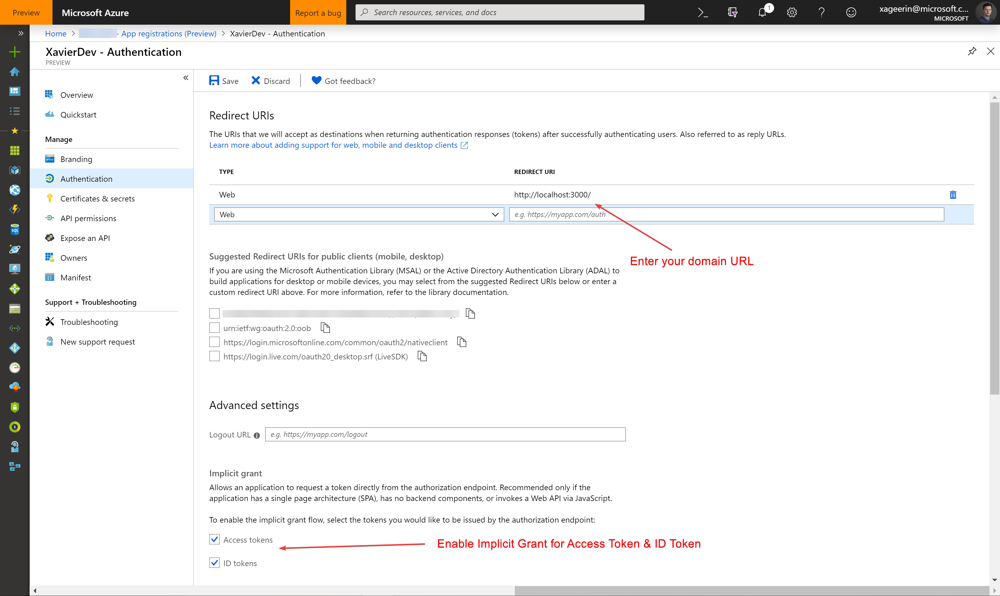

# Readme

## Introduction

The code here allows you to interface with an Azure Datalake Gen 2 through a web interface, where you are able to utilize certain features:

* Filesystems (List/Delete)
* Directory (List/Delete/Create)
* File (List/Delete/Upload/Download)

**Example Use Case:** You as a company want to allow your customers that are registered in your Active Directory to upload files easily through a web portal.

## Preview

## Installation

To utilize this application, certain changes are required and an application has to be registered in your Active Directory. Here a short summary for what is required:

* Azure Active Directory Application
* Adding Azure Active Directory Application to Data Lake
* Redirect URL Added
* API Permissions Added
* Implicit Grant Enabled
* Users Allowed on Datalake

### 1. Azure Active Directory (AAD) Registering Application

#### 1.1. Creation

First start by creating an application in the AAD, where you will then find the Tenant ID and Client ID.

#### 1.2. Configuring App API Permissions

Then go to the API Permissions to grant access to the data lake

#### 1.3. Configure how the authentication works

A last thing for the application registration is to allow the implicit flow and set the redirect url to your domain.

### 2. Azure Datalake 

#### 2.1. Configuring IAM

Give your application access to manage the datalake through the Blob Storage Data Contributor role

#### 2.2. Configuring CORS

Allow the web application to communicate with the REST api by configuring the CORS

### 3. Configuring the Web Application

A final thing to do is to copy the `config.templ.js` to `config.js` and fill in the parameters as found before:

* `tenantId`: your Azure Active Directory Tenant ID
* `clientId`: your configured application id
* `storageAccountName`: the account name for the storage account